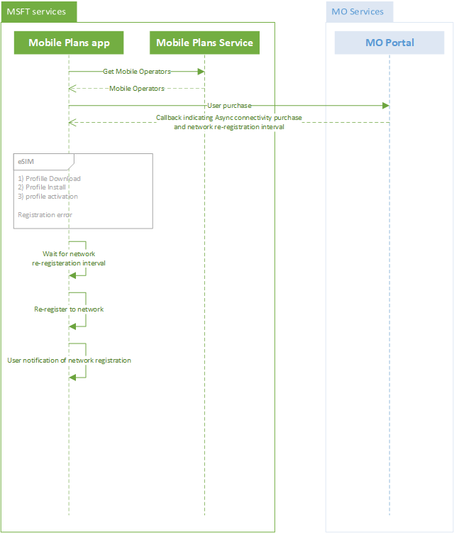

# Mobile Plans asynchronous fulfillment

[!include[Mobile Plans Beta Prerelease](../mobile-plans-beta-prerelease.md)]

## Overview

This topic provides the API details for mobile operators who can't either grant connectivity to the user at the time when the profile is profile is downloaded after purchase (Asynchronous connectivity) or when the profile is not available for download at purchase time (Asynchronous profile delivery).

## Asynchronous connectivity

The diagram below shows the high level flow supported by Mobile Plans to support delayed connectivity.



After the user successfully completes a purchase that requires a profile download from the mobile operator's MO Direct portal, the portal informs the Mobile Plans application to trigger the delayed connectivity flow using the DataMart.NotifyPurchaseWithProfileDownload API. The javascript function below shows an example usage of the API to inform the application that the user purchase requires a delayed provisioning of connectivity.

 ```javascript
function finishPurchaseWithDownload() {
        var metadata = DataMart.createPurchaseMetaData();
        metadata.userAccount = "New";
        metadata.purchaseInstrument = "New";
        metadata.moDirectStatus = "Complete";
        metadata.line = "New";
        metadata.planName = "2GB Monthly";
        DataMart.notifyPurchaseWithProfileDownload(metadata, "1$smdp.address$", 15);
    }
```

| Property Name | Type | Description | Example |
| --- | --- | --- | --- |
| userAccount | String | Possible values: New: Indicates that a new user account was created by the user Existing: Indicates that the user logged on with an existing user account Bailed: Indicates that the user ended the purchase flow at this step None: Indicates that the user didn’t reach this step | "userAccount":"New" |
| purchaseInstrument | String | Possible values: New: Indicates that a new user account was created by the user Existing: Indicates that the user logged on with an existing user account Bailed: Indicates that the user ended the purchase flow at this step None: Indicates that the user didn’t reach this step. | "purchaseInstrument":"New" |
| line | String | Possible values: New: Indicates that a SIM card was added by the user account Existing: Indicates that the transferred an existing line to the device Bailed: Indicates that the user ended the purchase flow at this step None: Indicates that the user didn’t reach this step. | "line":New" |
| moDirectStatus | String | Possible values: Complete: Indicates that the user completed the purchase successfully. ServiceError: Indicates that the user was unable to complete the purchase due to an MO service error. InvalidSIM: Indicates that the ICCID passed to the portal was incorrect. LogOnFailed indicates that the user failed to log in to the MO portal. PurchaseFailed: Indicates that the purchase failed due to a billing error. ClientError: Indicates that invalid arguments were passed to the portal. BillingError: Indicates that there was an error in with the user billing. | "moDirectStatus":"Complete" |
| planName | String | For a successful transaction, this field must not be empty and provide a descriptive plan name. For an unsuccessful transaction, this field must be an empty string. | "planName":"2GB Monthly"|
## Asynchronous profile delivery

Insert text here.